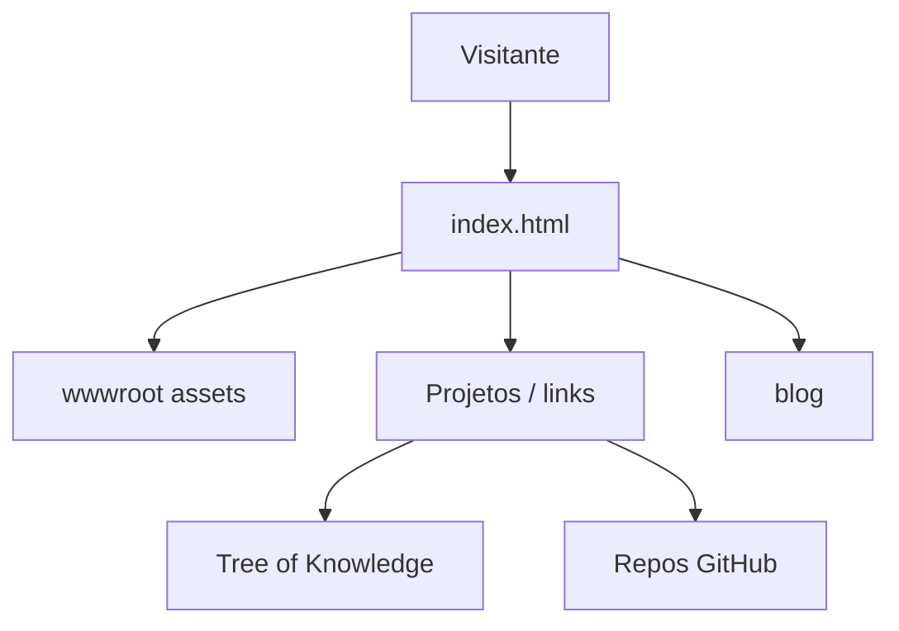

<div align="center">


# CanonEngineer.github.io

### Meu currículo profissional e vitrine de projetos no GitHub Pages


[Sobre](#-sobre) ·
[Features](#-features) ·
[Arquitetura](#-arquitetura--fluxo) ·
[Stack](#-stack) ·
[Estrutura](#-estrutura) ·
[Setup](#-como-rodar) ·
[Melhorias](#-melhorias-sugeridas) ·
[Autor](#-autor)

</div>

---

## 📌 Sobre

Site pessoal do **CanonEngineer** hospedado em GitHub Pages. Centraliza apresentação profissional, links de projetos, blog e ponto de entrada para o restante do ecossistema (incluindo a [Tree of Knowledge](https://canonengineer.github.io/TreeofKnowledge/)).

<div align="center">


</div>

---

## ✨ Features

| # | Capacidade |
|---|------------|
| 1 | Landing de portfólio com identidade visual própria |
| 2 | Seção de projetos e experiências |
| 3 | Blog estático em `blog/` |
| 4 | Assets em `wwwroot/` prontos para Pages |
| 5 | Deploy contínuo via push em `main` |

---

## 🏗️ Arquitetura / Fluxo



---

## 🛠️ Stack

| Tecnologia | Papel |
|------------|-------|
| HTML5 | Estrutura |
| CSS3 | Layout e visual |
| JavaScript | Interatividade |
| GitHub Pages | Hospedagem |

---

## 📂 Estrutura

```text
CanonEngineer.github.io/
├── index.html
├── wwwroot/          # assets públicos
├── blog/             # posts
├── scripts/          # utilitários
└── README.md
```

---

## 🚀 Como rodar

Clone e abra localmente:

```bash
git clone https://github.com/CanonEngineer/CanonEngineer.github.io.git
cd CanonEngineer.github.io
# abra index.html no navegador ou use um server estático
npx serve .
```

Site ao vivo: **https://canonengineer.github.io**

---

## ▶️ Uso

Navegue pelo portfólio, acesse o blog e use os links para os repositórios e para a Árvore do Conhecimento.

---

## 🌳 Tree of Knowledge

Este projeto está mapeado na árvore interativa:

<p>
  <a href="https://canonengineer.github.io/TreeofKnowledge/index.html?tree=canon-engineer-github-io">
    
  </a>
</p>

---

## 📈 Melhorias sugeridas

1. Dark/Light mode com preferência salva
2. Filtro de projetos por stack
3. i18n PT/EN
4. Mais posts técnicos no blog

---

## 👨‍💻 Autor

**Alessandro Canon (CanonEngineer)**  
Network Analyst · Developer · Cybersecurity Enthusiast

- GitHub: [https://github.com/CanonEngineer](https://github.com/CanonEngineer)
- Portfolio: [https://canonengineer.github.io](https://canonengineer.github.io)
- Tree of Knowledge: [https://canonengineer.github.io/TreeofKnowledge/](https://canonengineer.github.io/TreeofKnowledge/)

---

<div align="center">

⭐ Se este projeto te ajudou, deixe uma estrela!

</div>
